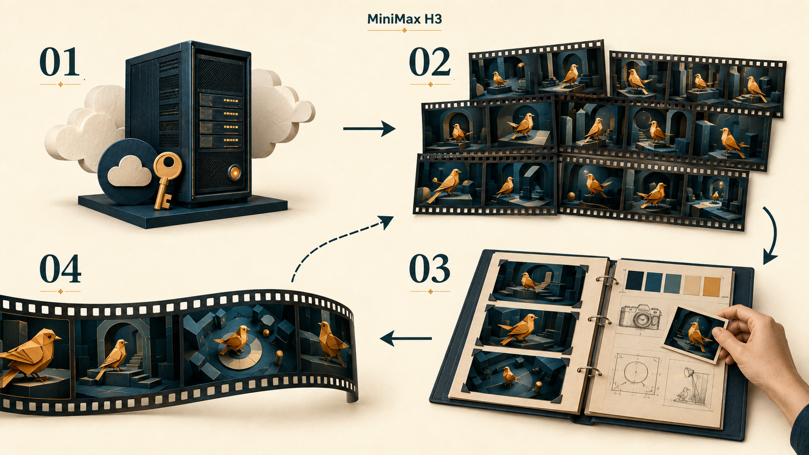
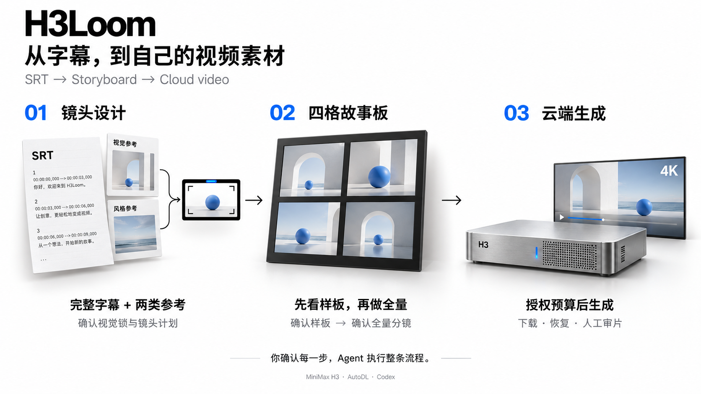

<div align="center">

# H3Loom

### 把云端模型，变成自己的视频创作工作室。

**简体中文** · [English](README.en.md) · [繁體中文](README.zh-TW.md) · [日本語](README.ja.md) · [한국어](README.ko.md)

[](pyproject.toml)
[](.agents/skills/srt-broll-producer/SKILL.md)
[](docs/autodl-production.md)
[](https://github.com/erduo1998-cell/h3loom/releases/tag/v0.2.0rc1)
[](LICENSE)

**自有云端部署 · 持续生成试验 · 沉淀个人风格**

</div>

部署自己的云端 MiniMax H3，通过反复试验、制作与复盘，逐步积累稳定的参考图、镜头语言和生成方法，形成可持续复用的个人风格。

**适合希望长期制作 AI 视频、愿意通过实践打磨风格的创作者。** 当前主流程把口播 SRT 变成独立的 4K B-roll 视频素材，由 Agent 承担镜头设计、故事板和云端执行。

> H3Loom 是独立的 MiniMax H3 云端创作工具，名称取 H3 + Loom（织机），便于按独立名称搜索。首个公开版本为 **v0.2.0rc1**；自有代码与三个 Skill 采用 [Apache-2.0](LICENSE)。模型许可另有地区和商业使用条件，见 [第三方许可](THIRD_PARTY_NOTICES.md)。新 GPU 从零部署与端到端生成尚待实机验收，详见 [发行核验](docs/release-readiness.md)。


### 24 秒项目介绍 · 纯代码制作


自动循环播放 · 无声；[观看有声版 MP4](https://erduo1998-cell.github.io/h3loom/) · [查看制作源码](media/intro-three/README.md)

视频由本地三维代码、动画和合成音效制作；银色模块是云端运行时的概念表达，不是实体硬件或 H3 实际生成样例。




<p align="center"><sub>01 自有云端环境 → 02 反复生成试验 → 03 筛选与复盘 → 04 沉淀个人风格，再用于下一轮制作</sub></p>

## 🎯 为什么做这个项目

一次生成带来一条视频，持续制作才能积累自己的方法。把模型部署在自己租用的服务器上，可以围绕同一套环境反复试验主体、材质、色彩、光线、景别和动作，保留有效做法，逐步减少随机试错。

这里真正积累的是三类资产：

| 积累什么 | 如何帮助下一次制作 |
| --- | --- |
| **自己的视觉参考** | 用稳定的角色、材质、配色和光线，让不同视频保持风格连续。 |
| **自己的镜头与提示词经验** | 知道哪些场景、动作和镜头组合更容易得到想要的结果。 |
| **自己的制作与筛选流程** | 先确认故事板，再生成视频；记录问题，把改进带回下一轮。 |

目标是让输出表现更稳定、可用素材成功率逐步提高。**本项目不包含训练或微调；单纯增加生成次数不会自动改变模型权重。** 改善来自你和 Agent 积累的参考、分镜、提示词与复盘经验。

## 🎬 从口播到独立视频素材



<p align="center"><sub>01 设计镜头 → 02 确认故事板 → 03 云端生成与下载；两张介绍图均为 AI 生成的概念示意，不是 H3 实际成片展示。</sub></p>

| 阶段 | 你与 Agent 一起完成什么 | 对应 Skill |
| --- | --- | --- |
| **01 · 设计镜头** | 读取完整 SRT、内容风格与口播衔接参考，确定画面、覆盖区间和摄影节拍。 | [srt-broll-producer](.agents/skills/srt-broll-producer/SKILL.md) |
| **02 · 确认故事板** | 每张严格四格，先确认 1–2 个样板，再做全量；选出每单元 3–5 张干净锚点图。 | [broll-storyboard-producer](.agents/skills/broll-storyboard-producer/SKILL.md) |
| **03 · 生成与收货** | 按已确认的故事板编译请求，在 AutoDL 生成、下载和恢复任务，最后人工审片。 | [h3-video-runtime](.agents/skills/h3-video-runtime/SKILL.md) |

视觉锁与镜头计划、样板、全量分镜分别经用户确认；确认后按预算执行。默认交付每条 **4–15 秒的独立 4K 素材**，不自动剪成完整口播视频。第二阶段依赖 Codex 宿主的 `imagegen` 生图能力。

[查看完整三阶段流程](docs/three-stage-workflow.md) · [查看安装与运行手册](docs/getting-started.md)

## 💰 真实成本：算力 + 长期存储

以下是**作者提供的生产实测经验与预算估算，记录于 2026-09-07**，不是平台实时统一报价，也不保证每个任务都达到相同成本。金额均为人民币（CNY）。

| 项目 | 作者实测 / 当前采用的口径 | 预算时怎样理解 |
| --- | --- | --- |
| **视频生成成本** | 约 **¥0.10 / 秒** | 按**全部生成视频的总时长**计算，包含未选用的候选；最终选中素材的每秒成本可能更高，长期存储另计。 |
| **GPU 服务器** | 约 **¥6 / 小时** | 按服务器实际占用时间计算；初始化、等待和重复尝试也会占用开机时间。 |
| **一次制作样本** | **20 个镜头，约 2 小时；作者记述费用约 ¥10** | 按 ¥6 × 2 小时预算应留 **约 ¥12**。实测描述与按时价估算分开记录。 |
| **长期资料存储** | 约 **¥3 / 天**，按 30 天为 **¥90 / 月** | 保留云端模型与资料的固定开支，应独立列入每月预算。 |

**如果持续保留一整月资料，只做一次上述 20 镜头任务，预算示例为 ¥90 + ¥12 ≈ ¥102。** 这是按所述存储规模、30 天和 2 小时算力推算的示例，不是套餐价，也没有把全部费用压进“每秒一毛钱”。

实际总支出还要考虑所用生图服务、Agent 订阅或其他额外服务的收费。GPU 关机后，应单独确认平台上的存储是否仍在保留和收费；不要把停止生成等同于所有费用归零。当前账单缺少完整证据时，程序会把实际费用保留为待核实，估算不冒充已支付账单。

## 🚀 开始前，准备什么

- **本机**：具备内置生图能力的 Codex、Python 3.11+、FFmpeg/FFprobe、OpenSSH；密码 SSH 另需 `sshpass`。本机不需要 NVIDIA 显卡。
- **云端**：当前部署材料对应 AutoDL 的 RTX PRO 6000 Blackwell 96GB，至少 120 GiB 内存、320 GB 可用持久盘；八个模型合计约 156.45 GB。
- **创作输入**：完整口播 SRT、内容风格参考、口播衔接参考，以及本次生成预算。

有仓库访问权限后，在本机克隆并安装：

```bash
git clone https://github.com/erduo1998-cell/h3loom.git h3loom
cd h3loom
uv sync --frozen
source .venv/bin/activate
```

没有 uv 时，可用 `python3 -m venv .venv` 创建环境，激活后执行 `python -m pip install -e .`。在 Codex 中打开该克隆目录，让 Agent 读取 `AGENTS.md`；项目已自带三个 Skill，不必覆盖全局安装。

先用合成字幕检查入口，不允许付费生成：

```bash
broll-video init --name "安装检查" --srt examples/demo.srt --ratio 16:9 --execution estimate_only
broll-video next <task-id>
```

`<task-id>` 使用上一条命令返回的任务编号。正式制作前，再按[运行手册](docs/getting-started.md)完成云端部署、视觉确认和本次预算授权。部署到新 GPU 仍需实机验收；本仓库不承诺任意云、任意 GPU 或任意生图后端都能直接运行。

## 💬 付费咨询与种子会员

**作者：刘冉 / 耳总。咨询为付费服务。**

**加入种子会员群，即可获得永久咨询资格。** 想了解云端部署、视频生成工作流、个人风格打磨或种子会员加入方式，可以扫码添加个人微信，备注 **「MiniMax H3 种子会员」**，沟通加入费用与咨询范围。

<p align="center">
  
</p>

<p align="center"><strong>付费咨询 · 种子会员享永久咨询资格</strong><br/>个人咨询入口，非 MiniMax 或 AutoDL 官方客服。</p>

<p align="center"><a href="https://erduo.art">个人网站</a> · <a href="https://github.com/erduo1998-cell">GitHub @erduo1998-cell</a></p>

## 📚 进一步了解

[安装与运行手册](docs/getting-started.md) · [生产流程](docs/three-stage-workflow.md) · [迁移范围](docs/migration-scope.md) · [已有验证](docs/migration-validation.md) · [第三方来源与许可状态](THIRD_PARTY_NOTICES.md)

实际视频仍需人工检查画面、文字和声音。介绍图与个人微信二维码的来源及展示用途见 [README 素材记录](docs/readme-assets.md)。
