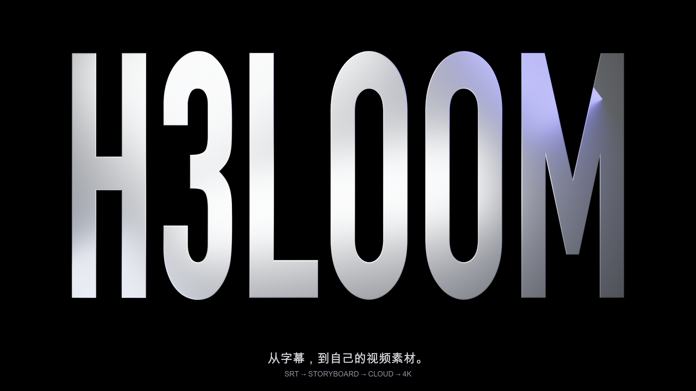

<div align="center">

# H3Loom

### 把雲端模型，變成自己的影片創作工作室。

[简体中文](README.md) · [English](README.en.md) · **繁體中文** · [日本語](README.ja.md) · [한국어](README.ko.md)

[](pyproject.toml)
[](.agents/skills/srt-broll-producer/SKILL.md)
[](docs/autodl-production.md)
[](THIRD_PARTY_NOTICES.md)

**自有雲端部署 · 持續生成試驗 · 累積個人風格**

</div>

部署自己的雲端 MiniMax H3，透過反覆試驗、製作與檢討，逐步累積穩定的參考圖、鏡頭語言和生成方法，形成能持續運用的個人風格。

**適合希望長期製作 AI 影片、願意透過實作磨練風格的創作者。** 目前主要流程會將口播 SRT 轉為獨立的 4K B-roll 影片素材，由 Agent 負責鏡頭設計、故事板和雲端執行。

> H3Loom 是獨立的 MiniMax H3 雲端創作工具，名稱取 H3 + Loom（織機）。目前是本機發行候選，尚未公開；自有內容授權條款待所有者確定。模型另有地區與商業使用條件，見 [第三方授權](THIRD_PARTY_NOTICES.md)。


### 24 秒專案介紹 · 純程式碼製作

[](docs/media/h3loom-intro.mp4)

[播放 MP4](docs/media/h3loom-intro.mp4) · [查看製作原始碼](media/intro/README.md)

影片由本機三維程式碼、動畫與合成音效製作；銀色模組是雲端執行環境的概念表達，不是實體硬體或 H3 實際生成樣例。


<p align="center"><sub>01 自有雲端環境 → 02 反覆生成試驗 → 03 篩選與檢討 → 04 累積個人風格，再用於下一輪製作</sub></p>

## 🎯 為什麼做這個專案

一次生成帶來一支影片，持續製作才能累積自己的方法。把模型部署在自己租用的伺服器上，可以在同一套環境中反覆試驗主體、材質、色彩、光線、景別和動作，保留有效做法，逐步減少隨機試錯。

這裡真正累積的是三類資產：

| 累積什麼 | 如何幫助下一次製作 |
| --- | --- |
| **自己的視覺參考** | 用穩定的角色、材質、配色和光線，讓不同影片保持風格連貫。 |
| **自己的鏡頭與提示詞經驗** | 知道哪些場景、動作和鏡頭組合更容易得到想要的結果。 |
| **自己的製作與篩選流程** | 先確認故事板，再生成影片；記錄問題，把改進帶回下一輪。 |

目標是讓輸出表現更穩定、可用素材的成功率逐步提高。**本專案不包含訓練或微調；單純增加生成次數不會自動改變模型權重。** 改善來自你和 Agent 累積的參考、分鏡、提示詞與檢討經驗。

## 🎬 從口播到獨立影片素材


<p align="center"><sub>01 設計鏡頭 → 02 確認故事板 → 03 雲端生成與下載；兩張介紹圖均為 AI 生成的概念示意，不是 H3 實際成片展示。</sub></p>

| 階段 | 你與 Agent 一起完成什麼 | 對應 Skill |
| --- | --- | --- |
| **01 · 設計鏡頭** | 讀取完整 SRT、內容風格與口播銜接參考，確定畫面、覆蓋區間和攝影節拍。 | [srt-broll-producer](.agents/skills/srt-broll-producer/SKILL.md) |
| **02 · 確認故事板** | 每張嚴格四格，先確認 1–2 個樣板，再製作全套；選出每單元 3–5 張乾淨錨點圖。 | [broll-storyboard-producer](.agents/skills/broll-storyboard-producer/SKILL.md) |
| **03 · 生成與驗收** | 依已確認的故事板編譯請求，在 AutoDL 生成、下載和恢復任務，最後人工審片。 | [h3-video-runtime](.agents/skills/h3-video-runtime/SKILL.md) |

視覺鎖與鏡頭計畫、樣板、全套分鏡分別經使用者確認；確認後依預算執行。預設交付每條 **4–15 秒的獨立 4K 素材**，不會自動剪成完整口播影片。第二階段依賴 Codex 宿主的 `imagegen` 生圖能力。

[查看完整三階段流程](docs/three-stage-workflow.md) · [查看安裝與執行手冊](docs/getting-started.md)

## 💰 實際成本：運算資源 + 長期儲存

以下是**作者提供的實際製作經驗與預算估算，記錄於 2026-09-07**，不是平台即時統一報價，也不保證每個任務都達到相同成本。金額均為人民幣（CNY）。

| 項目 | 作者實測／目前採用的計算基準 | 編列預算時如何理解 |
| --- | --- | --- |
| **影片生成成本** | 約 **¥0.10／秒** | 依全部生成影片的總時長計算，包含未選用的候選影片；最終選中素材的每秒成本可能更高，長期儲存另計。 |
| **GPU 伺服器** | 約 **¥6／小時** | 依伺服器實際占用時間計算；初始化、等待和重複嘗試也會占用開機時間。 |
| **一次製作樣本** | **20 個鏡頭，約 2 小時；作者記述費用約 ¥10** | 依 ¥6 × 2 小時編列預算應保留 **約 ¥12**。實測描述與按時價估算分開記錄。 |
| **長期資料儲存** | 約 **¥3／天**，以 30 天計為 **¥90／月** | 保留雲端模型與資料的固定開支，應獨立列入每月預算。 |

**如果持續保留一整個月的資料，只做一次上述 20 鏡頭任務，預算範例為 ¥90 + ¥12 ≈ ¥102。** 這是依所述儲存規模、30 天和 2 小時運算資源推算的範例，不是套裝價格，也沒有把全部費用壓進「每秒一毛錢」。

實際總支出還要考慮所用生圖服務、Agent 訂閱或其他額外服務的收費。GPU 關機後，應另外確認平台上的儲存空間是否仍在保留和計費；不要把停止生成等同於所有費用歸零。目前帳單缺少完整證據時，程式會將實際費用保留為待核實，估算不冒充已支付帳單。

## 🚀 開始前，準備什麼

- **本機**：具備內建生圖能力的 Codex、Python 3.11+、FFmpeg/FFprobe、OpenSSH；密碼 SSH 另需 `sshpass`。本機不需要 NVIDIA 顯示卡。
- **雲端**：目前部署資料對應 AutoDL 的 RTX PRO 6000 Blackwell 96GB，至少 120 GiB 記憶體、320 GB 可用持久儲存空間；八個模型合計約 156.45 GB。
- **創作輸入**：完整口播 SRT、內容風格參考、口播銜接參考，以及本次生成預算。

取得儲存庫存取權限後，在本機複製並安裝：

```bash
# PUBLIC_REPOSITORY_URL: use the final repository URL after publication.
git clone <PUBLIC_REPOSITORY_URL> h3loom
cd h3loom
uv sync --frozen
source .venv/bin/activate
```

沒有 uv 時，可用 `python3 -m venv .venv` 建立環境，啟用後執行 `python -m pip install -e .`。在 Codex 中開啟該複製目錄，讓 Agent 讀取 `AGENTS.md`；專案已內附三個 Skill，不必覆蓋全域安裝。

先用合成字幕檢查入口，不允許付費生成：

```bash
broll-video init --name "安装检查" --srt examples/demo.srt --ratio 16:9 --execution estimate_only
broll-video next <task-id>
```

`<task-id>` 使用上一條命令傳回的任務編號。正式製作前，再依[執行手冊](docs/getting-started.md)完成雲端部署、視覺確認和本次預算授權。部署到新 GPU 仍需實機驗收；本儲存庫不承諾任意雲端、任意 GPU 或任意生圖後端都能直接執行。

## 💬 付費諮詢與種子會員

**作者：劉冉／耳總。諮詢為付費服務。**

**加入種子會員群，即可獲得永久諮詢資格。** 想了解雲端部署、影片生成工作流程、個人風格打磨或種子會員加入方式，可以掃碼加入個人微信，備註 **「MiniMax H3 种子会员」**，洽詢加入費用與諮詢範圍。

<p align="center">
  
</p>

<p align="center"><strong>付費諮詢 · 種子會員享永久諮詢資格</strong><br/>個人諮詢入口，非 MiniMax 或 AutoDL 官方客服。</p>

<p align="center"><a href="https://erduo.art">個人網站</a> · <a href="https://github.com/erduo1998-cell">GitHub @erduo1998-cell</a></p>

## 📚 進一步了解

[安裝與執行手冊](docs/getting-started.md) · [製作流程](docs/three-stage-workflow.md) · [遷移範圍](docs/migration-scope.md) · [既有驗證](docs/migration-validation.md) · [第三方來源與授權狀態](THIRD_PARTY_NOTICES.md)

目前尚未公開發布，也未選定自有內容的發行授權。實際影片仍需人工檢查畫面、文字和聲音。介紹圖與個人微信 QR Code 的來源及展示用途見 [README 素材記錄](docs/readme-assets.md)。
