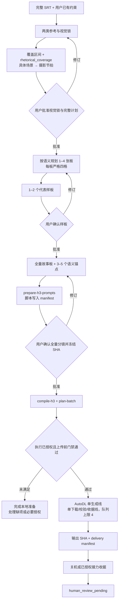

# MiniMax H3 三阶段生产流程

本文件说明阶段关系与任务授权，日常任务无需全量重读。主 Skill 保留当前阶段决策，字段与恢复细节按需查询；历史审计、旧任务 prompt 和 `legacy/` 不作为新任务指令。

阶段批准已有效且下一阶段已授权时直接继续，不把“阶段结束”理解为额外确认门。改变冻结设计、图像或脚本时，由变化影响决定退回哪一阶段并重新批准；日常执行不重做上游创作。

## 按任务读取

| 工作 | 入口 | 按需细节 |
| --- | --- | --- |
| 新建/修订视觉锁与镜头计划 | [srt-broll-producer](../.agents/skills/srt-broll-producer/SKILL.md) | [语义与字段](../.agents/skills/srt-broll-producer/references/semantic-decomposition.md)；首次规划完整读 SRT，局部修订只读相关上下文 |
| 样板、全量故事板、锚点与脚本 | [broll-storyboard-producer](../.agents/skills/broll-storyboard-producer/SKILL.md) | [四格与 Manifest](../.agents/skills/broll-storyboard-producer/references/four-panel-contract.md)；生图时加载 imagegen |
| 编译、生成、恢复与交付 | [h3-video-runtime](../.agents/skills/h3-video-runtime/SKILL.md) | 首次执行/连接变化查 [API 绑定](../.agents/skills/h3-video-runtime/references/api-contract.md)，故障/换机/交棒查 [恢复](../.agents/skills/h3-video-runtime/references/execution-recovery.md) |
| 安装、镜像/工作流迁移 | [AutoDL 生产说明](autodl-production.md) | [跨云迁移契约](h3-stack-portability.md)；full verify 不进入日常生成 |

项目画面标准见根 `AGENTS.md`；机器格式由 `schemas/`、批准命令和编译器维护，不复制多份字段清单。日期命名的审计文档只用于调查相关历史问题。

## 任务与授权契约

`task.json` 是机器执行的任务关系与授权唯一真源，用户明确指令是写入或变更授权的依据。先记录再执行；聊天摘要、文件名、旧产物、内部自检或审美判断不能代替授权记录。不存在有效授权时，不伪造 `explicit_user_instruction`。

- `inheritance_policy.mode`：`resume / regenerate / additive / replace / fresh_redesign`。非全新设计须有 `source_task_id`；`fresh_redesign` 须重新完成阶段一与二批准。
- `variant_ledger.assets[]`：逐项记录 `retain / replace / additive / archive-only` 处置及 `primary / backup / superseded / archive-only` 角色；`approved_generate_set` 明确本轮生成集合。恢复原冻结请求、增加候选或替换资产分别遵守已声明模式，不隐式扩大范围。
- 用户标注、参考、Design 和禁用项随任务继承，并在视觉锁绑定。
- 新任务契约为 `agent-know-gold-v1` + `three-stage-four-panel-v1`。`spec.draws_per_shot` 默认 2，只有用户明确授权本任务单抽时才写为 1；不改共享默认、不复制任务继续抽卡。
- `execution` 为 `estimate_only` 时只估价；真实执行须已授权。单任务硬预算默认 20 CNY，用户明确授权最高 50 CNY，实际额度只认本期 `task.json`。
- `shot_plan_approval / storyboard_sample_approval / storyboard_approval` 必须来自用户明确批准，并冻结相应产物、账本与 SHA-256。文件字节或 Panel 结构变更使相应批准失效；自动检查不能代替用户批准。
- 全量确认前，`prepare-h3-prompts` 将脚本写入同一 manifest；用户确认分镜，代码检查脚本。第三阶段只用 `compile-h3` 确定性编译，不临场重写创意。
- 已有 `prompt_id` 只查询与补下载；不确定提交保留 reservation，不自动重投。新增付费尝试和换机按恢复契约取得明确授权。
- 完整执行终态包含全部授权结果、输出 SHA、完整 delivery 与关机或已授权交棒收据；快速收货后保留人工审片状态，不声称已证明画面或音轨正确。
